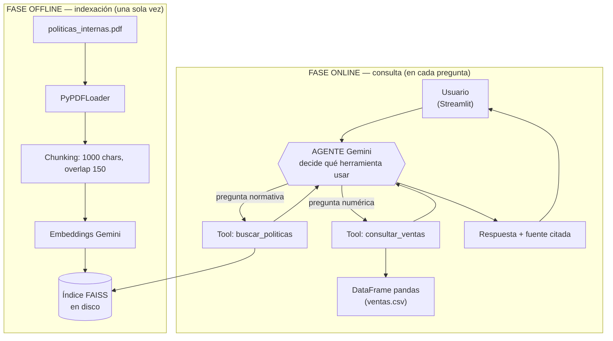

# Agente de documentos internos — Andes Data S.A.C.

Agente de IA que responde en lenguaje natural preguntas sobre los documentos internos de una empresa, consultando un manual de políticas en PDF y un histórico de ventas en CSV.

---

## 1. Descripción del proyecto y problema que resuelve

Este es el proyecto final de la ruta **IA for Tech** de Alura.

En cualquier organización la información operativa está repartida en archivos que nadie quiere abrir: un manual de políticas de decenas de páginas y una planilla de ventas con miles de filas. Cuando alguien necesita saber cuántos días de vacaciones le corresponden o cuánto se facturó el año pasado, el camino habitual es buscar el archivo, abrirlo, leerlo o construir una tabla dinámica. Es trabajo repetido, propenso a errores y que consume tiempo de personas que podrían estar haciendo otra cosa.

**Andes Data S.A.C.** es una consultora de datos peruana ficticia que sirve de caso de uso. El agente construido aquí atiende a su personal: recibe una pregunta escrita con normalidad, decide por sí mismo en cuál de las dos fuentes está la respuesta, la consulta y devuelve el dato citando de dónde salió. Si la respuesta no está en ninguna de las dos fuentes, lo dice en lugar de inventarla.

Lo que distingue este proyecto de un chatbot con documentos es esa decisión: el sistema no tiene una única ruta fija. El modelo evalúa la pregunta y elige la herramienta adecuada entre dos que funcionan con técnicas completamente distintas.

---

## 2. Arquitectura

El sistema es un **agente híbrido con dos herramientas**. El modelo lee la descripción de cada una y decide cuál usar en cada pregunta.

### Las dos herramientas

| Herramienta | Fuente | Técnica |
|---|---|---|
| `buscar_politicas` | `data/politicas_internas.pdf` | RAG — búsqueda semántica sobre un índice vectorial FAISS |
| `consultar_ventas` | `data/ventas.csv` | El LLM escribe código pandas y la herramienta lo ejecuta sobre el DataFrame |

**`buscar_politicas`** — Flujo offline: `PyPDFLoader` lee el PDF (un documento por página, con el número de página en los metadatos) → `RecursiveCharacterTextSplitter` lo parte en fragmentos de 1000 caracteres con 150 de solapamiento → los embeddings de Gemini convierten cada fragmento en un vector → el resultado se guarda como índice **FAISS persistido en disco** en `vectorstore/`. En consulta, recupera los **4 fragmentos más relevantes** y los devuelve con su número de página, lo que permite al agente citar la fuente.

**`consultar_ventas`** — El LLM recibe el esquema del DataFrame en la descripción de la herramienta y escribe una expresión pandas. La herramienta la ejecuta contra el DataFrame cargado en memoria y devuelve el resultado ya formateado como texto. **Si el código falla, el error se devuelve al agente como texto en lugar de lanzarse**: así el modelo lee el mensaje, corrige su código y vuelve a intentarlo en la siguiente vuelta del bucle.

### Por qué dos técnicas distintas y no una

Porque las dos fuentes son de naturaleza opuesta:

- El **PDF es texto no estructurado**. No hay nada que calcular sobre él: solo encontrar el pasaje que habla del tema preguntado. La búsqueda semántica es exactamente eso.
- El **CSV es tabular y las preguntas exigen *calcular***: sumar, agrupar, ordenar, rankear. Buscar "fragmentos parecidos" en una tabla nunca respondería *"¿cuánto facturamos en 2024?"*, porque esa cifra no está escrita en ninguna fila: hay que producirla.

Aplicar RAG al CSV daría respuestas plausibles y numéricamente falsas. Por eso cada fuente tiene la técnica que le corresponde, y el agente es quien decide cuál toca.

### Diagrama



### Separación de capas

`app.py` es únicamente presentación: no contiene lógica del agente. Toda la lógica vive en `src/`, de modo que la misma implementación sirve para la interfaz web, para la terminal (`python -m src.agent`) o para un futuro despliegue.

---

## 3. Stack técnico

Versiones verificadas, instaladas y en funcionamiento:

| Componente | Versión |
|---|---|
| Python | 3.13 |
| `langchain` | 1.3.14 |
| `langchain-google-genai` | 4.3.1 |
| `faiss-cpu` | 1.14.3 |
| `pypdf` | 6.14.2 |
| `pandas` | 2.3.3 |
| `streamlit` | 1.60.0 |
| `python-dotenv` | instalado |

**Modelos de Google Gemini:**

- LLM: `gemini-flash-lite-latest`, con `temperature=0` (respuestas deterministas: en un asistente que cita políticas y cifras no se busca creatividad, sino exactitud).
- Embeddings: `models/gemini-embedding-001`, vectores de 3072 dimensiones.

`requirements.txt` incluye además `reportlab`, usado solo por el generador de datos ficticios, no por la aplicación.

### Mapeo del proyecto a componentes de LangChain

| Pieza del proyecto | Componente de LangChain | Dónde |
|---|---|---|
| Carga del PDF | `PyPDFLoader` | `src/ingest.py` |
| Fragmentación del texto | `RecursiveCharacterTextSplitter` | `src/ingest.py` |
| Conversión de texto a vectores | `GoogleGenerativeAIEmbeddings` | `src/ingest.py` |
| Índice vectorial y búsqueda por similitud | `FAISS` | `src/ingest.py` |
| Modelo de lenguaje | `ChatGoogleGenerativeAI` | `src/agent.py` |
| Declaración de las herramientas | decorador `@tool` | `src/tools.py` |
| Bucle del agente (decidir → ejecutar → releer → responder) | `create_agent` | `src/agent.py` |

---

## 4. Datos

Ambos archivos los genera `scripts/generar_datos.py`, con **semilla fija 42** en `random` y `numpy.random`, de modo que cada ejecución reproduce exactamente los mismos datos. Eso permite documentar y probar sobre cifras concretas.

### `data/politicas_internas.pdf`

Manual de políticas internas de Andes Data S.A.C. — **5 páginas, 12 secciones**: objeto y alcance, horario laboral, trabajo remoto, vacaciones, licencias y permisos, viáticos y reembolsos, seguridad de la información, código de conducta, capacitación, evaluación de desempeño, beneficios corporativos y canal de denuncias.

### `data/ventas.csv`

**1200 filas**, del **2023-01-01 al 2025-12-29**.

| Columna | Tipo | Contenido |
|---|---|---|
| `fecha` | texto | `YYYY-MM-DD` (no es `datetime`) |
| `region` | texto | 5 regiones: Lima, Arequipa, Cusco, Trujillo, Piura |
| `producto` | texto | 7 productos |
| `categoria` | texto | 3 categorías: Consultoría, Licencias, Capacitación |
| `cliente` | texto | 40 empresas |
| `vendedor` | texto | 8 vendedores |
| `cantidad` | int | unidades vendidas |
| `precio_unitario` | float | precio por unidad en soles |
| `monto_total` | float | `cantidad × precio_unitario` |

---

## 5. Ejemplos de preguntas y respuestas

Batería de pruebas ejecutada con `scripts/probar_agente.py`: **7 de 7 casos aprobados**.

Cada caso valida **dos cosas a la vez**: que la respuesta es correcta **y** que el agente llegó a ella usando la herramienta adecuada. Acertar el dato con la herramienta equivocada sería casualidad, no un agente que razona.

| Pregunta | Herramienta elegida | Respuesta obtenida |
|---|---|---|
| ¿Cuántos días de vacaciones me corresponden al año? | `buscar_politicas` | 30 días calendario tras 12 meses continuos de servicio; fraccionables en periodos no menores a 7 días. Fuente: pág. 2 |
| ¿Cuál es la política de trabajo remoto? | `buscar_politicas` | Modelo híbrido de 3 días remotos y 2 presenciales; los martes son de presencia obligatoria en la sede de Surco; el 100 % remoto requiere el formulario FR-GH-014; subsidio de conectividad de S/ 120 al mes. Fuente: págs. 1-2 |
| ¿Cuál es el tope de reembolso por viáticos? | `buscar_politicas` | S/ 180 por día en viajes nacionales; USD 95 por día en viajes internacionales. Fuente: pág. 3 |
| ¿Cuál fue el producto más vendido en diciembre de 2024? | `consultar_ventas` | Capacitacion Analytics, con 204 unidades (S/ 229,379.26). El agente añadió por su cuenta que, medido por facturación, el líder del mes fue Data Warehouse con S/ 2,796,867.22 |
| ¿Cuánto facturamos en total durante 2024? | `consultar_ventas` | S/ 27,926,577.04 |
| ¿Qué región tuvo mejor desempeño en ventas? | `consultar_ventas` | Lima, con S/ 28,377,704.98, seguida de Arequipa (S/ 12,751,938.35), Trujillo, Cusco y Piura |
| **¿Cuál es el color favorito del gerente?** (pregunta trampa) | ninguna concluyente | "No encuentro esa información en los documentos disponibles" |

### El caso importante es el último

La pregunta trampa no tiene respuesta en ninguna de las dos fuentes. Un modelo sin control habría improvisado un color. Este agente reconoce el límite de sus fuentes y lo declara. **Esa es la prueba de que no alucina**, y es tan relevante como acertar las seis anteriores: un asistente interno que inventa una cifra de facturación o un tope de viáticos es peor que no tener asistente.

---

## 6. Cómo ejecutar el proyecto

Instrucciones para **Windows con PowerShell**. Todos los comandos se ejecutan desde la raíz del proyecto.

### 1. Clonar el repositorio

```powershell
git clone https://github.com/<tu-usuario>/agente-ia-andes-data.git
cd agente-ia-andes-data
```

### 2. Crear y activar el entorno virtual

```powershell
python -m venv .venv
.\.venv\Scripts\Activate.ps1
```

### 3. Instalar las dependencias

```powershell
pip install -r requirements.txt
```

### 4. Configurar la API key de Google

Consigue una clave gratuita en **https://aistudio.google.com/apikey**. Copia `.env.example` como `.env` y coloca ahí tu clave:

```powershell
Copy-Item .env.example .env
notepad .env
```

Contenido de `.env`:

```
GOOGLE_API_KEY=tu_clave_real_aqui
```

> **Aviso de seguridad:** `.env` está listado en `.gitignore` y **nunca debe subirse al repositorio**. Una API key publicada en GitHub queda expuesta y puede ser usada por terceros con cargo a tu cuenta.

### 5. (Opcional) Regenerar los datos ficticios

Los archivos ya vienen incluidos en el repositorio; este paso solo hace falta si quieres reconstruirlos.

```powershell
python scripts/generar_datos.py
```

### 6. Validar la conexión con Gemini

```powershell
python scripts/smoke_test.py
```

Comprueba que la API key funciona, descubre qué modelo de chat responde en tu cuenta, verifica que ese modelo soporta *tool calling* y confirma que el modelo de embeddings responde.

### 7. Construir el índice vectorial

```powershell
python -m src.ingest
```

**Este paso es necesario en una instalación nueva**: la carpeta `vectorstore/` no se versiona, así que hay que generarla localmente. Al terminar, el script hace una prueba rápida de recuperación para confirmar que el índice responde.

### 8. Levantar la aplicación web

```powershell
streamlit run app.py
```

Abre **http://localhost:8501**.

### 9. Alternativa por terminal

Si prefieres conversar con el agente sin interfaz web:

```powershell
python -m src.agent
```

Escribe `salir` para terminar.

### 10. Ejecutar la batería de pruebas

```powershell
python scripts/probar_agente.py
```

Lanza los 7 casos e informa cuáles pasaron y qué herramienta usó el agente en cada uno.

> **Nota:** si al ejecutar un script aparece un error del tipo `ModuleNotFoundError: No module named 'src'`, es porque lo estás lanzando desde otra carpeta. Ejecuta siempre desde la **raíz del proyecto**, con el entorno virtual activado.

---

## 7. Estructura del proyecto

```
agente-ia-andes-data/
├── app.py                      # Interfaz web (Streamlit). Solo presentación.
├── requirements.txt            # Dependencias del proyecto
├── .env.example                # Plantilla de configuración (copiar como .env)
├── .gitignore                  # Excluye .env, .venv/ y vectorstore/
│
├── src/                        # Toda la lógica del agente
│   ├── config.py               # Rutas, nombres de modelo, API key y parámetros del RAG
│   ├── ingest.py               # Fase offline: PDF -> chunks -> embeddings -> FAISS
│   ├── tools.py                # Las dos herramientas: buscar_politicas y consultar_ventas
│   └── agent.py                # Ensamblado: modelo + herramientas + instrucciones
│
├── scripts/
│   ├── generar_datos.py        # Genera el PDF y el CSV ficticios (semilla 42)
│   ├── smoke_test.py           # Valida la conexión con Gemini y descubre modelos
│   └── probar_agente.py        # Batería de 7 pruebas de aceptación
│
├── data/
│   ├── politicas_internas.pdf  # Manual de políticas (5 páginas, 12 secciones)
│   └── ventas.csv              # Histórico de ventas (1200 filas, 2023-2025)
│
└── vectorstore/                # Índice FAISS — GENERADO, no versionado
```

---

## 8. Capturas de pantalla


*El agente responde una pregunta normativa usando `buscar_politicas` y cita la página del manual.*


*El agente responde una pregunta numérica usando `consultar_ventas`, calculando sobre el CSV con pandas.*

---

## 9. Decisiones técnicas

### Por qué no se usó `create_pandas_dataframe_agent`

El camino habitual para consultar un DataFrame con LangChain es `create_pandas_dataframe_agent`, que vive en `langchain-experimental`. Ese paquete es explícitamente el laboratorio de LangChain: cambia sin aviso, no ofrece garantías de estabilidad y es el que peor ha seguido la reestructuración de APIs de LangChain 1.x. Construir sobre él significaba aceptar que el proyecto pudiera romperse con la siguiente versión.

La alternativa elegida fue escribir la herramienta a mano: `consultar_ventas` se declara con el decorador `@tool` de LangChain y la ejecuta el `create_agent` de LangChain. Es decir, **se resolvió sin salir del framework y sin depender de su rama experimental**, con la ventaja añadida de controlar exactamente qué se ejecuta, cómo se formatea el resultado y qué pasa cuando el código falla.

### Por qué el modelo se descubre en vez de fijarse a ciegas

Durante el desarrollo aparecieron dos problemas que ningún tutorial anticipa, y los dos se resolvieron con la misma decisión de diseño:

1. **`gemini-2.5-flash` devuelve 404** con el mensaje *"no longer available to new users"* en cuentas creadas recientemente. El nombre de modelo que aparece en la mayoría de los ejemplos publicados simplemente no funciona en una cuenta nueva.
2. **Los alias `latest` apuntan a los modelos con menor cuota gratuita.** `gemini-flash-latest` resolvía a `gemini-3.6-flash`, cuyo cupo en capa gratuita es de **20 peticiones por día**. Como cada pregunta consume entre 2 y 3 llamadas (una para decidir la herramienta, otra para redactar tras leer su resultado), ese cupo se agota en menos de diez preguntas y la aplicación devuelve `429 RESOURCE_EXHAUSTED`.

Por eso `scripts/smoke_test.py` **descubre automáticamente** qué modelo funciona: recorre una lista de candidatos **ordenada por cuota gratuita, no por potencia**, y se queda con el primero que responda. Y no se limita a comprobar que devuelve texto: verifica también que **soporta *tool calling***, porque sin esa capacidad no hay agente posible, solo un chatbot.

El modelo por defecto en `src/config.py` es `gemini-flash-lite-latest`, validado por ese script contra una cuenta real. Como la cuota se aplica **por modelo**, agotar uno no bloquea a los demás: si ocurre, basta ejecutar el smoke test y declarar `MODELO_LLM=<el que funcione>` en el archivo `.env`, **sin tocar el código**.

### FAISS persistido en disco

El índice vectorial se guarda en `vectorstore/` y se recarga en los arranques siguientes. Regenerar los embeddings del PDF en cada inicio sería lento y consumiría cuota de API repetidamente para producir exactamente el mismo resultado. `cargar_indice()` construye el índice automáticamente si no lo encuentra, de modo que la aplicación nunca falla en el primer arranque por haber olvidado la ingesta.

### `@st.cache_resource` en la interfaz

Streamlit vuelve a ejecutar el script completo en cada interacción del usuario. Sin caché, el índice vectorial y el CSV se recargarían del disco en cada pregunta. `@st.cache_resource` hace que el agente se construya una sola vez por sesión del servidor.

---

## 10. Limitaciones conocidas

- **`consultar_ventas` ejecuta código Python generado por el LLM.** El espacio de nombres se restringe a `df` y `pd`, y la salida se trunca para no inundar el prompt, pero **no es un sandbox real**. Es aceptable para uso local sobre datos propios; no debería exponerse a usuarios no confiables en internet sin aislamiento adicional (contenedor, intérprete restringido o servicio de ejecución externo).
- **El agente no tiene memoria persistente entre sesiones.** El historial de la conversación se mantiene dentro de la sesión de Streamlit y se pierde al recargar la página o reiniciar el servidor.
- **Los documentos son fijos.** No se pueden cargar archivos nuevos desde la interfaz: para cambiar las fuentes hay que reemplazar los archivos en `data/` y volver a ejecutar la ingesta.
- **La capa gratuita de Gemini tiene un cupo diario por modelo.** Cada pregunta consume entre 2 y 3 llamadas a la API, así que un uso intensivo puede agotarlo y producir un error `429 RESOURCE_EXHAUSTED`. No es un fallo del proyecto: la cuota se renueva cada día y se aplica por modelo, de modo que cambiar `MODELO_LLM` en el `.env` por otro modelo disponible lo resuelve de inmediato (ver sección 9).
- **`langchain-community` emite un `DeprecationWarning`** al importarse. El paquete está siendo descontinuado en favor de paquetes independientes por integración. No afecta al funcionamiento actual.

---

## 11. Despliegue

**El despliegue en la nube está pendiente.** La aplicación se entrega funcionando en local, con instrucciones reproducibles paso a paso (sección 6).

La arquitectura ya lo facilita: la interfaz es Streamlit, la lógica está separada en `src/` y las dependencias están acotadas por rango en `requirements.txt`. Opciones evaluadas, ordenadas por esfuerzo:

| Opción | Consideraciones |
|---|---|
| **Streamlit Community Cloud** | La vía más directa: despliegue desde el repositorio de GitHub, con la API key cargada como secreto de la plataforma. |
| **Hugging Face Spaces** | También soporta Streamlit de forma nativa; la clave se gestiona como *secret* del Space. |
| **OCI Compute (Always Free)** | La opción sugerida por el enunciado del desafío. Requiere aprovisionar la instancia, instalar el entorno y exponer el puerto; a cambio da control total sobre la máquina. |

En cualquiera de las tres hay que tener en cuenta dos puntos: la carpeta `vectorstore/` no se versiona, por lo que el índice debe generarse en el arranque del despliegue; y la limitación del sandbox descrita en la sección 10 pasa a ser relevante en cuanto la aplicación quede accesible públicamente.

---

## Créditos

Proyecto desarrollado como desafío final de la ruta **IA for Tech** de **Alura**. Andes Data S.A.C. y todos los datos utilizados son ficticios, generados de forma reproducible por `scripts/generar_datos.py`.
